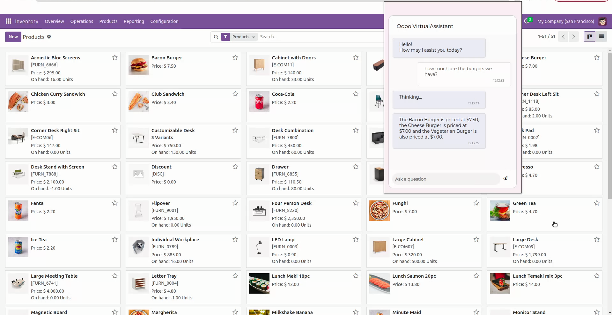

# HoverSite

## Overview

HoverSite is a browser extension designed to enhance user interaction with web content. It analyses webpages, extracts relevant information, and engages users through a chat interface, providing concise summaries and answers to user queries.

## Setup and Installation

### Chrome

After cloning this repo to your computer:

1. Go to `hoversite/chrome/scripts/` and copy the file [`openai-dist.js`](chrome/scripts/openai-dist.js) to a new file called `openai.js`. Fill in the values for `SYSTEM_PROMPT`, `OPENAI_TOKEN`, and `OPENAI_MODEL` (examples have been provided). You can get your `OPENAI_TOKEN` by [creating an OpenAI account](https://platform.openai.com/signup) and then [creating a secret key](https://platform.openai.com/api-keys).

1. Open the extensions page in Google Chrome: type `chrome://extensions` in the url bar and press enter.

1. Switch on "Developer mode".

1. Click the "Load unpacked" button and select the Chrome extension folder (hoversite/chrome).

1. Go to Extensions in the browser and select HoverSite to start using it!

### Firefox

Unfortunately, based on my research, Firefox does not currently allow extensions to load URLs and as such, this extension would not be able to request data from the OpenAI API. I am happy to be proven wrong though, so feel free to [fork this repo and shoot a PR](CONTRIBUTING.md) if you're able to get it working.

## Usage

Once installed, the HoverSite extension icon will appear in your browser's toolbar. Clicking on this icon will open the chat interface. From here, users can type questions or commands, which the extension will process to provide relevant information extracted from the current webpage or through external analysis facilitated by the OpenAI API.

## Documentation

Please visit the [Documentation page](DOCUMENTATION.md).

## Contributing

Please refer to our [Contributing Guidelines](CONTRIBUTING.md).

## Licence

[MIT Licence](LICENCE.md).